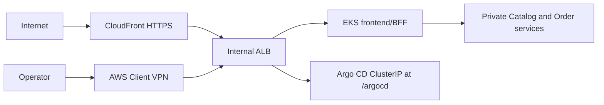

# TechX Infrastructure

Minimal Terraform foundation for the TechX internship demo. Configuration and
offline/read-only preflight are implemented; no AWS mutation is allowed until
the checksum-bound approval checkpoint.

## Offline and read-only workflow

```powershell
./scripts/verify.ps1
./scripts/preflight.ps1
./scripts/cost-estimate.ps1 -Hours 12
```

The checks pin Terraform/providers, validate and scan all modules, verify EKS
1.35/add-on/AZ/quota availability, simulate required IAM permissions, and keep
the conservative cost upper bound below the 60 USD apply gate. Read-only
preflight does not create AWS resources.

Create a private, ignored saved plan only when the email and same-day destroy
deadline are correct:

```powershell
Copy-Item ./environments/demo/terraform.tfvars.example ./environments/demo/domain-vpn.private.tfvars

# Plan A creates the foundation and internal ALB. Certificate ARNs stay only in
# the ignored private variable file.
./scripts/create-reviewed-plan.ps1 `
  -Stage foundation `
  -BudgetAlertEmail 'owner@example.com' `
  -DestroyDeadline '<YYYY-MM-DDTHH:mm:ss+07:00>' `
  -MaximumHours 12
```

The script isolates the Helm repository cache, refreshes the caller `/32`,
creates `.plans/demo-foundation.tfplan`, verifies every managed resource is in scope,
checks `add/change/destroy`, writes a SHA-256 checksum, and ends at
`WAITING_FOR_USER_APPROVAL`. The private plan and summary are ignored by Git.
After Plan A is applied and the shared internal ALB ARN is copied into the
private variable file, create Plan B with `-Stage edge`. Plan B is independently
reviewed and creates only CloudFront, private Route 53, and Client VPN resources.

If a partially created foundation cannot reach the EKS API because CGNAT
rotates across known egress ranges, create a reviewed `recovery` stage with
`-PublicAccessCidrs`. Only that stage can enable up to four temporary `/24` or
`/32` ranges. A reviewed edge migration may preserve those exact temporary
ranges until Client VPN acceptance; a later hardening plan removes them.

Do not run `terraform apply` directly from configuration. Phase 7 may apply
only the exact saved plan after the user repeats the confirmation sentence in
the private approval summary. Apply through the checksum/deadline guard so the
same isolated Helm repository cache is used during planning and execution:

```powershell
./scripts/apply-reviewed-plan.ps1 `
  -Stage foundation `
  -ApprovedChecksum '<sha256-from-summary>' `
  -ApprovedDestroyDeadline '<deadline-from-summary>'
```

Any changed account, region, IP, estimate, deadline, configuration, or
checksum invalidates approval and requires a new plan. The budget in the plan
sends actual-cost alerts at 40, 60, and 72 USD; 80 USD remains the hard cap,
while alerts are not a real-time hard stop.

## Certificate and DNS prerequisites

Request the public ACM certificate for `shop.dinhminhkhoa.id.vn` in
`us-east-1`, publish its validation CNAME in Cloudflare as DNS-only, and wait
for ACM status `ISSUED`. Never store a Cloudflare token in this repository.

After explicit approval for the certificate mutation, the guarded helper
returns the exact validation record without exposing any private key:

```powershell
./scripts/prepare-domain-certificates.ps1 `
  -Action RequestPublic `
  -ExpectedAccountId '<12-digit-account-id>'

# Run after adding the returned DNS-only CNAME in Cloudflare.
./scripts/prepare-domain-certificates.ps1 `
  -Action Status `
  -ExpectedAccountId '<12-digit-account-id>'
```

Generate the Client VPN mutual-TLS material outside the workspace:

```powershell
./scripts/new-client-vpn-pki.ps1
```

Import the generated server certificate and operator reference certificate into
ACM using their certificate, private key, and `ca.crt` chain. Put only the two
returned ACM ARNs in `domain-vpn.private.tfvars`. The generated operator
certificate/key are later embedded into the exported `.ovpn` file locally; the
entire PKI directory and completed profile are secrets and must not appear in
Git, command logs, screenshots, or report evidence.

```powershell
./scripts/prepare-domain-certificates.ps1 `
  -Action ImportVpn `
  -ExpectedAccountId '<12-digit-account-id>'
```

After Plan B creates an available endpoint, export the completed profile outside
Git. The helper validates the AWS account and endpoint, normalizes the AWS VPN
hostname, embeds the operator credential locally, and restricts the directory
ACL without printing profile contents:

```powershell
./scripts/export-client-vpn-profile.ps1 `
  -ClientVpnEndpointId 'cvpn-endpoint-<id>' `
  -ExpectedAccountId '<12-digit-account-id>'
```

## Environment lifecycle

The baseline profile can retain its foundation between tests. Suspend it by
removing the Argo CD Application and ALB before scaling the worker node to zero:

```powershell
./scripts/suspend-environment.ps1 -RetentionDeadline '2026-08-20T18:00:00+07:00'
```

Resume it for the next AWS-only test without Terraform apply:

```powershell
./scripts/resume-environment.ps1
```

The IDLE state still keeps the EKS control plane and other foundation resources,
so it still has a cost. Retention is limited to seven days.

The domain/VPN profile deliberately rejects this baseline IDLE path: an internal
ALB and Client VPN association would continue to accrue hourly cost. After the
acceptance window, disconnect AWS VPN Client, remove the public Cloudflare
`shop` CNAME, and perform the dependency-ordered teardown:

```powershell
./scripts/domain-vpn-inventory.ps1
./scripts/destroy-domain-vpn-environment.ps1 `
  -ExpectedAccountId '<12-digit-account-id>' `
  -ConfirmDestroy
```

The teardown removes edge resources first, then workload/Ingress resources,
waits for the internal ALB to disappear, destroys the foundation, and fails if
the final TechX inventory is not empty. Private keys, VPN profiles, private
Terraform variables, saved plans, and approval summaries remain Git-ignored.

## Deliberate security exceptions

- EKS 1.35 uses the default AWS-owned KMS v2 envelope encryption available to
  EKS 1.28+, avoiding a needless customer-key charge.
- The EKS public API is normally enabled only for one validated caller IPv4
  `/32`; its private endpoint is also enabled. A reviewed recovery plan may
  temporarily use up to four reviewed ranges for rotating CGNAT and must return to `/32` or
  private-only access after VPN acceptance.
- Two public subnets and one public node IPv4 are intentional in this no-NAT
  demo so the node can reach EKS add-ons/ECR. Two private subnets host only the
  internal ALB and one Client VPN association. No node security group opens
  direct Internet ingress.
- VPC CNI NetworkPolicy enforcement is explicitly enabled. Only the temporary
  baseline profile uses an internet-facing ALB; the domain/VPN profile uses one
  internal ALB reached by CloudFront or the VPN association security group.

## Shared deployment contract

This table is the handoff contract copied verbatim across `techx-platform`,
`techx-chart`, and `techx-infra`. Contract changes must update all three
copies, every affected consumer, and the corresponding tests in one coordinated
change.

| Contract item        | Locked value                                                                                                                                                                                     |
| -------------------- | ------------------------------------------------------------------------------------------------------------------------------------------------------------------------------------------------ |
| AWS region           | `us-east-1`                                                                                                                                                                                      |
| Kubernetes namespace | `techx-demo`                                                                                                                                                                                     |
| Services / ports     | `frontend:3000`, `catalog-api:3001`, `order-api:3002`                                                                                                                                            |
| Cluster DNS          | `frontend.techx-demo.svc.cluster.local:3000`, `catalog-api.techx-demo.svc.cluster.local:3001`, `order-api.techx-demo.svc.cluster.local:3002`                                                     |
| Secret / key         | Secret `techx-demo-secrets`, data key `order-api-key`; injected as `ORDER_API_KEY` only into frontend and Order                                                                                  |
| Runtime environment  | Frontend: `CATALOG_API_URL`, `ORDER_API_URL`, `ORDER_API_KEY`; Catalog: `CATALOG_PORT`; Order: `ORDER_PORT`, `CATALOG_API_URL`, `ORDER_API_KEY`, `ORDER_STORE_TTL_MS`, `ORDER_STORE_MAX_RECORDS` |
| Health / readiness   | Every service exposes unauthenticated `GET /healthz` and `GET /readyz`                                                                                                                           |
| Order store          | In-memory, TTL `3600000` ms, maximum `1000` records; restart intentionally loses orders and idempotency records                                                                                  |
| Pricing              | Catalog price snapshot; shipping `999` cents below subtotal `5000`, otherwise free; `totalCents = subtotalCents + shippingCents`                                                                 |
| Images               | `058114477594.dkr.ecr.us-east-1.amazonaws.com/techx/frontend:demo-{short-sha}`, `.../techx/catalog:demo-{short-sha}`, `.../techx/order:demo-{short-sha}`                                         |
| Exposure             | CloudFront is the only public entry point and reaches one internal ALB through a VPC origin; Catalog, Order, and Argo CD remain `ClusterIP` services                                             |
| Public URL           | `https://shop.dinhminhkhoa.id.vn/`; public `/argocd` and `/argocd/*` return `403`                                                                                                                |
| Private operator URL | The same hostname resolves to the internal ALB over AWS Client VPN; Argo CD is available only at `https://shop.dinhminhkhoa.id.vn/argocd/`                                                       |
| DNS and TLS          | Cloudflare owns public DNS, Route 53 provides the private split-view record, and one issued ACM certificate covers the storefront hostname                                                       |
| Network boundary     | One internal ALB serves frontend and Argo CD; only CloudFront may use HTTP `80`, only the Client VPN association security group may use HTTPS `443`                                              |

Infrastructure constraints stay additional to the shared handoff: EKS `1.35`,
one `t3.medium` AL2023 x86_64 node, forecast at or below 60 USD, hard cap 80
USD, and explicit user approval before the first AWS mutation.



No AWS resource exists merely because this repository exists. `terraform apply`
is forbidden until the reviewed-plan approval checkpoint.

Licensed under Apache-2.0. See [LICENSE](LICENSE).

Bootstrap verification:

```powershell
./scripts/verify.ps1
```
