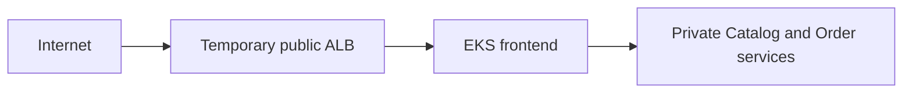

# TechX Infrastructure

Minimal Terraform foundation for the TechX internship demo. AWS resources are implemented in Phase 6 and may only be applied after all local gates and explicit user approval.

## Shared deployment contract

| Item | Value |
|---|---|
| Region | `us-east-1` |
| Namespace | `techx-demo` |
| Secret / key | `techx-demo-secrets` / `order-api-key` |
| Cluster | EKS `1.35`, single `t3.medium` AL2023 x86_64 node |
| ECR repositories | `techx/frontend`, `techx/catalog`, `techx/order` |
| Exposure | One temporary public ALB for frontend only |
| Budget | Forecast <= 60 USD; hard cap 80 USD; explicit approval before apply |



No AWS resource exists merely because this repository exists. `terraform apply` is forbidden until the reviewed-plan approval checkpoint.

Licensed under Apache-2.0. See [LICENSE](LICENSE).

Bootstrap verification:

```powershell
./scripts/verify.ps1
```
