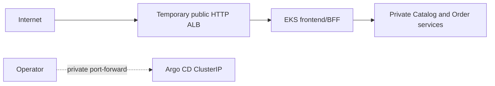

# TechX Infrastructure

Minimal Terraform foundation for the TechX internship demo. Configuration and
offline/read-only preflight are implemented; no AWS mutation is allowed until
the checksum-bound approval checkpoint.

## Offline and read-only workflow

```powershell
./scripts/verify.ps1
./scripts/preflight.ps1
./scripts/cost-estimate.ps1 -Hours 12
```

The checks pin Terraform/providers, validate and scan all modules, verify EKS
1.35/add-on/AZ/quota availability, simulate required IAM permissions, and keep
the conservative cost upper bound below the 60 USD apply gate. Read-only
preflight does not create AWS resources.

Create a private, ignored saved plan only when the email and same-day destroy
deadline are correct:

```powershell
./scripts/create-reviewed-plan.ps1 `
  -BudgetAlertEmail 'owner@example.com' `
  -DestroyDeadline '2026-08-06T18:00:00+07:00' `
  -MaximumHours 12
```

The script isolates the Helm repository cache, refreshes the caller `/32`,
creates `.plans/demo.tfplan`, verifies every managed resource is in scope,
checks `add/change/destroy`, writes a SHA-256 checksum, and ends at
`WAITING_FOR_USER_APPROVAL`. The private plan and summary are ignored by Git.

Do not run `terraform apply` directly from configuration. Phase 7 may apply
only the exact saved plan after the user repeats the confirmation sentence in
the private approval summary. Apply through the checksum/deadline guard so the
same isolated Helm repository cache is used during planning and execution:

```powershell
./scripts/apply-reviewed-plan.ps1 `
  -ApprovedChecksum '<sha256-from-summary>' `
  -ApprovedDestroyDeadline '<deadline-from-summary>'
```

Any changed account, region, IP, estimate, deadline, configuration, or
checksum invalidates approval and requires a new plan. The budget in the plan
sends actual-cost alerts at 40, 60, and 72 USD; 80 USD remains the hard cap,
while alerts are not a real-time hard stop.

## Retained lab lifecycle

After the first reviewed apply, do not destroy and recreate the foundation for
each test. Suspend it after testing by removing the Argo CD Application and ALB
before scaling the worker node to zero:

```powershell
./scripts/suspend-environment.ps1 -RetentionDeadline '2026-08-20T18:00:00+07:00'
```

Resume it for the next AWS-only test without Terraform apply:

```powershell
./scripts/resume-environment.ps1
```

The IDLE state still keeps the EKS control plane and other foundation resources,
so it still has a cost. Retention is limited to seven days. Run full Terraform
destroy only for a structural infrastructure change or final project closure.

## Deliberate security exceptions

- EKS 1.35 uses the default AWS-owned KMS v2 envelope encryption available to
  EKS 1.28+, avoiding a needless customer-key charge.
- The EKS public API is enabled only for one validated caller IPv4 `/32`; its
  private endpoint is also enabled.
- Two public subnets and one public node IPv4 are intentional in this no-NAT
  demo so the node can reach EKS add-ons/ECR. No node security group opens
  direct Internet ingress.
- VPC CNI NetworkPolicy enforcement is explicitly enabled. Only the temporary
  frontend Ingress creates an Internet-facing load balancer later in Phase 8.

## Shared deployment contract

This table is the handoff contract copied verbatim across `techx-platform`,
`techx-chart`, and `techx-infra`. Contract changes must update all three
copies, every affected consumer, and the corresponding tests in one coordinated
change.

| Contract item | Locked value |
| --- | --- |
| AWS region | `us-east-1` |
| Kubernetes namespace | `techx-demo` |
| Services / ports | `frontend:3000`, `catalog-api:3001`, `order-api:3002` |
| Cluster DNS | `frontend.techx-demo.svc.cluster.local:3000`, `catalog-api.techx-demo.svc.cluster.local:3001`, `order-api.techx-demo.svc.cluster.local:3002` |
| Secret / key | Secret `techx-demo-secrets`, data key `order-api-key`; injected as `ORDER_API_KEY` only into frontend and Order |
| Runtime environment | Frontend: `CATALOG_API_URL`, `ORDER_API_URL`, `ORDER_API_KEY`; Catalog: `CATALOG_PORT`; Order: `ORDER_PORT`, `CATALOG_API_URL`, `ORDER_API_KEY`, `ORDER_STORE_TTL_MS`, `ORDER_STORE_MAX_RECORDS` |
| Health / readiness | Every service exposes unauthenticated `GET /healthz` and `GET /readyz` |
| Order store | In-memory, TTL `3600000` ms, maximum `1000` records; restart intentionally loses orders and idempotency records |
| Pricing | Catalog price snapshot; shipping `999` cents below subtotal `5000`, otherwise free; `totalCents = subtotalCents + shippingCents` |
| Images | `058114477594.dkr.ecr.us-east-1.amazonaws.com/techx/frontend:demo-{short-sha}`, `.../techx/catalog:demo-{short-sha}`, `.../techx/order:demo-{short-sha}` |
| Exposure | Exactly one temporary public HTTP ALB routes to frontend/BFF; Catalog, Order, Argo CD, and any administrative UI remain private `ClusterIP` services |
| Public URL | `http://{alb-dns-name}/`; no custom domain and no public observability URL |

Infrastructure constraints stay additional to the shared handoff: EKS `1.35`,
one `t3.medium` AL2023 x86_64 node, forecast at or below 60 USD, hard cap 80
USD, and explicit user approval before the first AWS mutation.



No AWS resource exists merely because this repository exists. `terraform apply`
is forbidden until the reviewed-plan approval checkpoint.

Licensed under Apache-2.0. See [LICENSE](LICENSE).

Bootstrap verification:

```powershell
./scripts/verify.ps1
```
